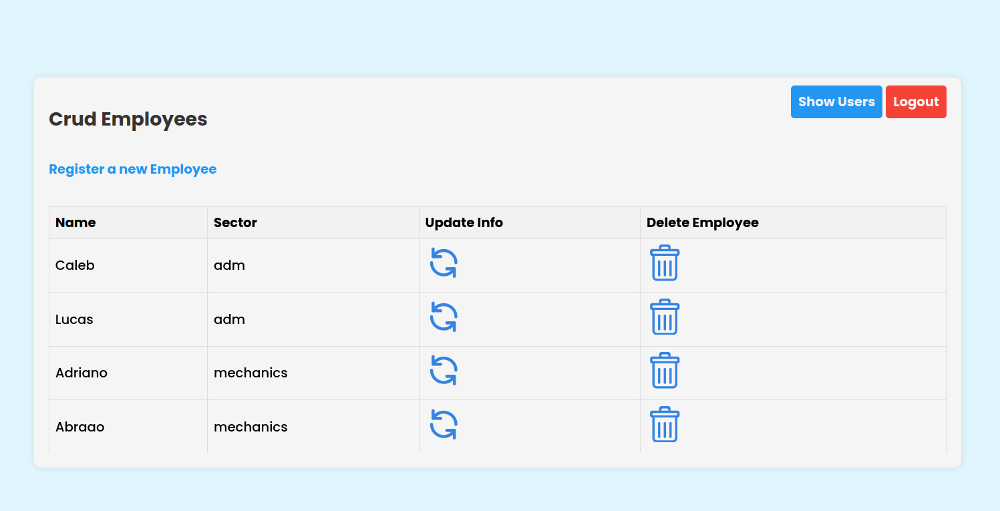
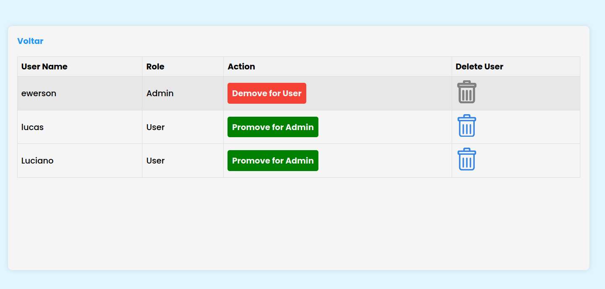
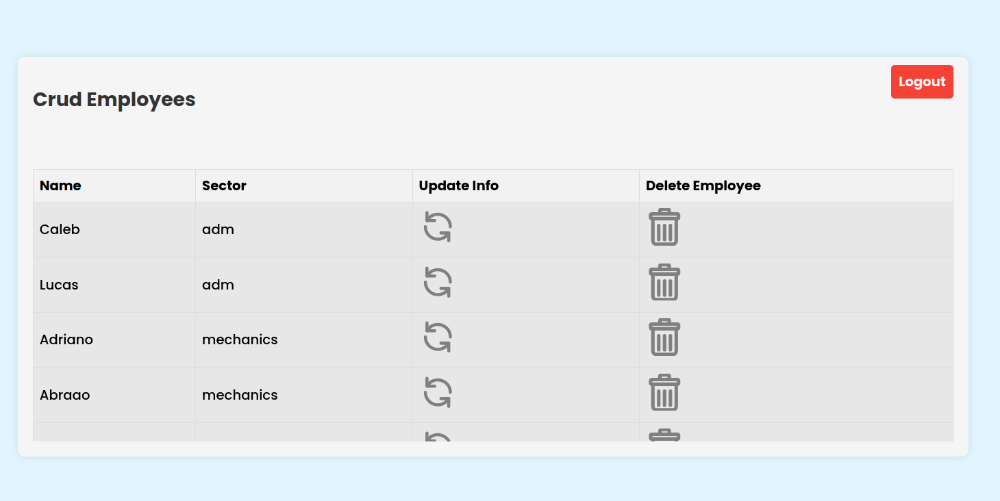

## Crud Employee

### Home App for Admin's

### Admin's user control view

### Home App for User's

***
> Objective: Create a system that allows the registration, viewing, modification, and deletion of employees stored in a database; in addition, implement the concepts of user registration, cryptography, sessions, authentication, and authorization. 

| Technologies used  |     |  
| -------------      | ------------- |  
| Back-end           | Node.js       | 
| Framework          | Express       | 
| Libraries          | handlebars, mysql2, bodyparser, bycript and jsonwebtoken | 
| Database           | MySql         | 
| Plataform          | [ X ] Web  [ ] Android [ ] Desktop      |

